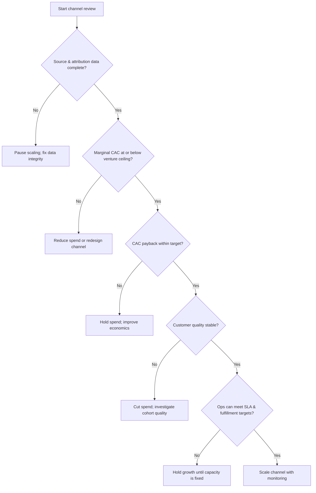

# Measurement Spine & Channel Economics (Phases 1–2)

This is the quantitative core. If it is weak, everything downstream becomes storytelling.

## Phase 1 — CRM & data model

The schema below is the minimum operating standard. It ties together the customer-capital
logic (sales-and-marketing spend as investment), the CAC-boundary problem (you cannot manage
what you cannot attribute), contribution-margin-based lifetime value, and the governance
requirement to inventory systems, assign accountability, and monitor over time.

| Field name | Type | Required | Notes |
|---|---|---|---|
| venture_id | enum/string | Yes | Portfolio company or business unit |
| lead_id | string/UUID | Yes | Persistent unique identifier |
| account_id | string/UUID | Yes | Company or household record |
| lead_source | enum | Yes | Organic, paid search, outbound, referral, event, partner, marketplace, other |
| source_detail | string | Yes | Specific platform, partner, school, rep, community, or campaign |
| campaign_id | string | No | Campaign or initiative identifier |
| referrer_id | string/UUID | No | Referring customer, driver, partner, or employee |
| first_contact_at | datetime | Yes | First known touchpoint |
| owner_id | string/UUID | Yes | Current accountable rep or recruiter |
| pipeline_stage | enum | Yes | New, working, qualified, proposal, negotiation, closed-won, closed-lost |
| qualified_at | datetime | No | When formal criteria were met |
| quote_value | decimal(12,2) | No | Gross quoted contract/transaction value |
| closed_revenue | decimal(12,2) | No | Realized booked revenue |
| direct_fulfillment_cost | decimal(12,2) | No | Delivery cost directly attributable to the deal |
| contribution_margin_amount | decimal(12,2) | Computed | Closed revenue − direct variable delivery/servicing costs |
| contribution_margin_pct | decimal(5,2) | Computed | Contribution margin percentage |
| acquisition_cost_allocated | decimal(12,2) | Yes | Attributable spend, labor, tooling, fees, incentives |
| first_purchase_at | date | No | Date of first commercial transaction |
| repeat_revenue_amount | decimal(12,2) | No | Revenue after the initial transaction |
| customer_status | enum | Yes | Prospect, active, inactive, churned |
| lost_reason | enum | No | Budget, no decision, competitor, timing, quality, price, unqualified |
| sales_cycle_days | integer | Computed | First contact → closed-won/closed-lost |
| next_action_due_at | datetime | Yes | Required next step |
| compliance_status | enum | No | For logistics, regulated sales, recruiting, credentialed partners |
| data_quality_flag | enum | Yes | Clean, needs review, duplicate, incomplete, at risk |

**Enforcement rules that make the economics auditable:**
- `sales_cycle_days`, `contribution_margin_amount`, `contribution_margin_pct`, and cohort tags
  are **computed**, never hand-editable.
- `lead_source`, `pipeline_stage`, `lost_reason`, `customer_status` are **controlled picklists**.
- Stage changes require owner, next action, expected value, and source to be populated.

This is the only reliable way to make channel CAC, marginal CAC, referral economics, and
service-capacity planning trustworthy.

**Follow-up fields:** the follow-up engine (Phase 3) extends this schema with `cadence_track`,
`cadence_step`, `attempt_count`, `last_contact_at`, `last_contact_channel`, `last_response_at`,
`no_contact_reason`, `reactivation_eligible_at`, and `do_not_contact`. See `follow-up.md` — a
CRM without these can't run a real follow-up pipeline.

## Phase 2 — Channel-level economics

### The four formulas

**Channel CAC** (period t, channel c):
```
Channel CAC = (channel spend + attributable labor + channel tools/fees + channel incentives)
              ÷ new customers acquired from channel c in period t
```

**CAC payback (months):**
```
CAC Payback = CAC ÷ average monthly contribution margin per newly acquired customer from channel c
```

**LTV : CAC:**
```
LTV:CAC = expected discounted lifetime contribution margin per customer from channel c ÷ CAC
```

**Marginal CAC:**
```
Marginal CAC = Δ acquisition spend ÷ Δ incremental customers
```

### The decisive modeling choice: base LTV on contribution margin, not revenue

Value customers on observed and predicted **contribution margins** over time, not revenue.
Any business with meaningful variable delivery, support, onboarding, servicing, commission,
or incentive cost will have revenue-based LTV that badly overstates what it can actually
reinvest in acquisition. Contribution-margin LTV is what the business can truly recycle.

### Why marginal CAC, not blended CAC, is the scaling instrument

Blended CAC averages customers acquired at very different spend levels, smoothing away the
shape of the acquisition-cost curve. Marginal CAC exposes the curve — the cost of the *next*
customer, which is what a scaling decision actually depends on. Keep blended CAC only as a
board-level summary.

### The six marginal-CAC risks (name these when interpreting a reading)

1. **Attribution uncertainty** — multiple channels influence one conversion.
2. **Conversion lag** — spend and conversion fall in different periods.
3. **Natural-demand contamination** — some "incremental" customers would have converted anyway.
4. **Customer-quality deterioration** — later cohorts retain or buy less.
5. **Channel volatility** — auction prices, seasonality, competition, macro demand distort short-run reads.
6. **Small-sample instability** — low volumes make incremental-cost estimates noisy.

These are exactly why blended CAC is a weak scaling rule: it hides all six.

### Explicit scale / reduce rules (make these non-discretionary)

**Scale a channel only when ALL hold:**
- Source/attribution data is complete enough to trust.
- Marginal CAC is at or below the venture's approved acquisition ceiling.
- CAC payback is within the venture's target window.
- Customer quality (retention, margin) is holding across cohorts.
- Operations can absorb the added volume **without service degradation**.

**Reduce or pause a channel when ANY hold:**
- Marginal CAC exceeds the expected contribution margin on the next cohort.
- Payback worsens for two consecutive cohorts.
- Retention/quality of new cohorts drops.
- Operational service levels slip.

### Decision flow



### Reporting cadence (decide faster than the data decays)

- **Weekly — pipeline motion & follow-up:** new leads, speed-to-first-contact, attempts-per-lead,
  contact/connect rate, follow-up SLA compliance, rotting-pipeline rate, qualified opportunities,
  proposals/quotes, wins, pipeline value, duplicate/incomplete-record rate.
- **Monthly — economics & follow-up depth:** channel CAC, marginal CAC, CAC payback, win rate,
  contribution margin, new-customer retention, referral rate, lost reasons, repeat revenue,
  touches-to-close, nurture reactivation rate, closed-lost-with-too-few-attempts rate.
- **Quarterly — slow truths:** cohort LTV, pricing realization, channel saturation, concentration
  risk, service-capacity constraints, customer-capital investment by venture.

### 90-day rollout shape (adapt dates to the engagement)

1. **Foundation (weeks 1–3):** CRM schema, data dictionary, field ownership; source mapping and attribution rules.
2. **Economics (weeks 3–6):** CAC/LTV/payback in BI + CRM; marginal-CAC tests and cohort baselines.
3. **Acquisition (weeks 5–9):** referral workflow and outreach cadences; partner/recruiting pipeline launch.
4. **AI & governance (weeks 9–12):** CRM hygiene automation and QA; AI policy, human oversight, model monitoring.
5. **Review (week 13):** executive review and adoption of the operating rule.
