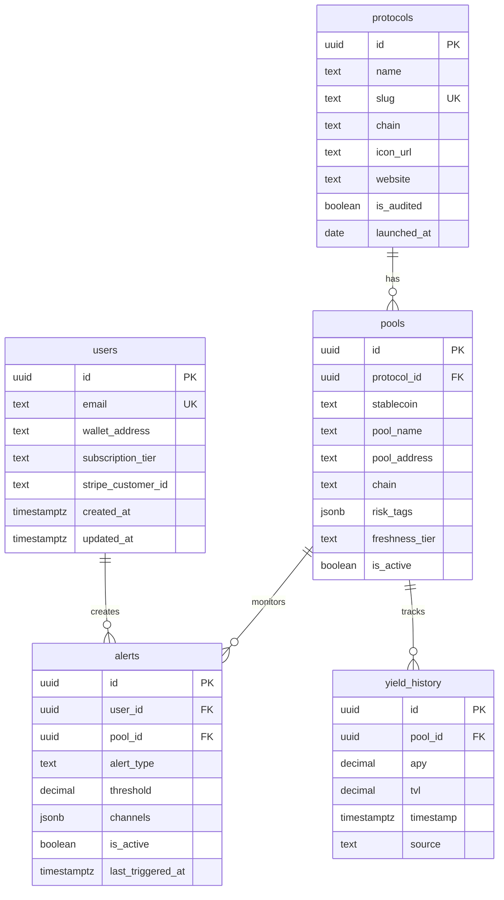

# Data Model — Rendite

## Overview
This document describes the database schema for Rendite. The system uses Supabase (PostgreSQL) as the primary data store.

## Entity Relationship Diagram



## Tables

### `users`
Stores user accounts (can sign up via email or wallet).

| Column | Type | Description |
|--------|------|-------------|
| `id` | UUID | Primary key |
| `email` | TEXT | Email address (optional) |
| `wallet_address` | TEXT | Connected wallet (optional) |
| `subscription_tier` | TEXT | `free` / `pro` / `analyst` / `institutional` |
| `stripe_customer_id` | TEXT | Stripe customer ID for billing |

### `protocols`
DeFi protocols we track (Aave, Curve, Morpho, etc.).

| Column | Type | Description |
|--------|------|-------------|
| `id` | UUID | Primary key |
| `name` | TEXT | Display name (e.g., "Aave V3") |
| `slug` | TEXT | URL-friendly identifier |
| `chain` | TEXT | Primary chain |
| `is_audited` | BOOLEAN | Has security audits |
| `launched_at` | DATE | Protocol launch date |

### `pools`
Individual yield opportunities (e.g., "EURC Supply on Aave").

| Column | Type | Description |
|--------|------|-------------|
| `id` | UUID | Primary key |
| `protocol_id` | UUID | Foreign key to protocols |
| `stablecoin` | TEXT | `EURC` / `EURS` / `eEUR` / `agEUR` / `cEUR` |
| `pool_name` | TEXT | Display name |
| `risk_tags` | JSONB | Array of risk tag objects |
| `freshness_tier` | TEXT | `hot` / `warm` / `cold` (update frequency) |

### `yield_history`
Time-series data for APY and TVL tracking.

| Column | Type | Description |
|--------|------|-------------|
| `id` | UUID | Primary key |
| `pool_id` | UUID | Foreign key to pools |
| `apy` | DECIMAL | Current APY (e.g., 5.24 = 5.24%) |
| `tvl` | DECIMAL | Total Value Locked in EUR |
| `timestamp` | TIMESTAMPTZ | When this data was captured |
| `source` | TEXT | Data source (e.g., "DeFiLlama") |

### `alerts`
User-configured notifications.

| Column | Type | Description |
|--------|------|-------------|
| `id` | UUID | Primary key |
| `user_id` | UUID | Foreign key to users |
| `pool_id` | UUID | Optional: specific pool to monitor |
| `alert_type` | TEXT | `apy_above` / `apy_below` / `tvl_drop` |
| `threshold` | DECIMAL | Trigger value |
| `channels` | JSONB | `["email"]` / `["email", "telegram"]` |
| `is_active` | BOOLEAN | Whether alert is enabled |

## Views

### `latest_yields`
Convenience view that joins pools, protocols, and the most recent yield data.

```sql
SELECT * FROM latest_yields;
```

Returns: Current APY, TVL, protocol info, and risk tags for all active pools.

## Data Freshness Tiers

| Tier | Update Frequency | Example Pools |
|------|-----------------|---------------|
| `hot` | Every 15 min | Top 20 by TVL (Aave, Curve mainnet) |
| `warm` | Every 60 min | Mid-tier pools |
| `cold` | Every 4 hours | Long-tail, low TVL pools |

## Row Level Security (RLS)

- **Public data** (protocols, pools, yields): Anyone can read
- **User data** (users, alerts): Users can only access their own records

## Migrations

All schema changes are tracked in `/supabase/migrations/`:
- `0001_init.sql` - Initial schema
- `0002_seed_data.sql` - Sample data for development
